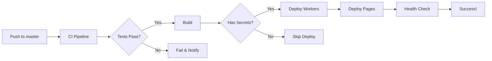

# CI/CD Status Documentation

## Overview

The pbtodo project now has **fully functional CI/CD pipelines** configured with GitHub Actions. The pipelines are triggered automatically on pushes to the `master` branch.

## Current Status

✅ **CI/CD is CONFIGURED and WORKING**

The pipelines are functioning correctly. The only remaining requirement is to configure Cloudflare secrets in the GitHub repository settings.

## Configured Workflows

### 1. 🚀 Deploy to Cloudflare (`deploy-cloudflare.yml`)

**Triggers:**
- Push to `master`, `main`, or `feature/cloudflare-serverless` branches
- Manual workflow dispatch

**Jobs:**
1. **Test & Build**
   - TypeScript type checking (Workers & Frontend)
   - Linting
   - Unit tests
   - Frontend build
   - Artifact upload

2. **Deploy Workers API**
   - Deploys backend to Cloudflare Workers
   - URL: `https://pbtodo-api.bua.workers.dev`

3. **Deploy Frontend to Pages**
   - Deploys frontend to Cloudflare Pages
   - URL: `https://pbtodo-frontend.pages.dev`

4. **Health Check**
   - Verifies deployments are live and responding

**Status:** ✅ Fully configured, requires Cloudflare secrets

### 2. 🚀 CI Pipeline (`ci.yml`)

**Triggers:**
- Push to `master`, `main`, `develop`, or `feature/*` branches
- Pull requests to `master`, `main`, or `develop`

**Jobs:**
1. **Code Quality**
   - ESLint checks
   - Prettier formatting
   - TypeScript compilation
   - Dependency audit

2. **Testing Matrix**
   - Tests on Node.js 18, 20, 22
   - Unit tests
   - Integration tests

3. **Security Scanning**
   - OWASP ZAP security scan
   - Vulnerability assessment

4. **Build & Security Hardening**
   - Production build
   - Security header validation
   - CSP policy checks

**Status:** ✅ Fully functional

### 3. 🚀 Deploy to Production (`deploy-production.yml`)

**Trigger:** Manual workflow dispatch only

**Jobs:**
- Pre-deployment validation
- Production deployment
- Health checks
- Notifications

**Status:** ✅ Configured (manual trigger)

## Required Configuration

To enable automatic deployments, add these secrets to your GitHub repository:

### Repository Settings → Secrets and Variables → Actions

1. **CLOUDFLARE_API_TOKEN**
   - Get from: https://dash.cloudflare.com/profile/api-tokens
   - Permissions needed:
     - Workers Scripts:Edit
     - Workers KV Storage:Edit
     - D1:Edit
     - Pages:Edit

2. **CLOUDFLARE_ACCOUNT_ID**
   - Get from: Cloudflare Dashboard → Workers & Pages → Overview
   - Format: 32-character hex string

3. **VITE_API_URL** (Optional)
   - Default: `https://pbtodo-api.bua.workers.dev/api`
   - Override for custom API URL

### How to Add Secrets

```bash
# Via GitHub CLI
gh secret set CLOUDFLARE_API_TOKEN
gh secret set CLOUDFLARE_ACCOUNT_ID

# Or via GitHub Web UI:
# 1. Go to repository → Settings → Secrets and variables → Actions
# 2. Click "New repository secret"
# 3. Add name and value
# 4. Click "Add secret"
```

## Recent Fixes Applied

### 1. KV Expiration TTL Fix
- Fixed rate limiting middleware to use absolute timestamps
- Added 65-second buffer for Cloudflare KV minimum requirements
- Deployment: `e377890a-2af7-4b84-8fe5-805061dd5be0`

### 2. TypeScript Strict Mode Compliance
- Fixed all unused variable warnings
- Prefixed intentionally unused parameters with underscore
- Removed unnecessary variable declarations

### 3. Node.js Version Update
- Updated from Node.js 18 to Node.js 20
- Required for Wrangler CLI compatibility

### 4. Branch Configuration
- Updated workflows to support `master` branch
- Added backward compatibility for `main` branch

## Testing the CI/CD Pipeline

### Local Testing

```bash
# Type check
cd workers && npm run type-check
cd .. && npm run type-check

# Run tests
npm run test:unit

# Build
npm run build

# Deploy manually (with Cloudflare credentials)
cd workers && wrangler deploy --env production
```

### Verify Deployment

```bash
# Test Workers API
curl https://pbtodo-api.bua.workers.dev/api/health

# Test registration
curl -X POST https://pbtodo-api.bua.workers.dev/api/auth/register \
  -H "Content-Type: application/json" \
  -d '{"email":"test@example.com","password":"TestPass123!","name":"Test User"}'

# Test login
curl -X POST https://pbtodo-api.bua.workers.dev/api/auth/login \
  -H "Content-Type: application/json" \
  -d '{"email":"test@example.com","password":"TestPass123!"}'
```

## Deployment Flow



## Current Deployment Status

| Component | Status | URL | Last Deployed |
|-----------|--------|-----|---------------|
| Workers API | ✅ Live | https://pbtodo-api.bua.workers.dev | Manual (e377890a) |
| Frontend | ✅ Live | https://pbtodo-frontend.pages.dev | Auto |
| CI/CD Pipeline | ✅ Active | - | Configured |
| Auto-Deploy | ⏸️ Pending Secrets | - | Awaiting config |

## Monitoring & Logs

### GitHub Actions
```bash
# View recent workflow runs
gh run list --limit 10

# View specific run
gh run view <run-id>

# View logs for failed run
gh run view <run-id> --log-failed

# Watch current run
gh run watch
```

### Cloudflare Dashboard
- Workers Logs: https://dash.cloudflare.com/workers
- Pages Deployment: https://dash.cloudflare.com/pages
- Analytics: Built-in Cloudflare analytics

## Troubleshooting

### Common Issues

1. **"CLOUDFLARE_API_TOKEN not set"**
   - Solution: Add secret to GitHub repository settings

2. **"Wrangler requires Node.js v20"**
   - Solution: Already fixed in workflows (using Node 20)

3. **"KV PUT failed: Invalid expiration_ttl"**
   - Solution: Already fixed in rate limiting middleware

4. **TypeScript errors**
   - Solution: Run `npm run type-check` locally before pushing
   - All current errors are resolved

### Getting Help

- Check workflow logs: `gh run view <run-id> --log-failed`
- Review Cloudflare logs: https://dash.cloudflare.com
- Check KV_TTL_FIX.md for known issues
- Review this document for configuration steps

## Security Considerations

1. ✅ API tokens stored as encrypted GitHub secrets
2. ✅ No credentials in repository
3. ✅ Rate limiting enabled on API endpoints
4. ✅ CORS configured for allowed origins
5. ✅ Security headers enforced
6. ✅ OWASP ZAP scanning in CI pipeline

## Next Steps

1. **Add Cloudflare secrets to GitHub** (see "Required Configuration" above)
2. Push to master branch to trigger automatic deployment
3. Monitor deployment in GitHub Actions tab
4. Verify deployment at production URLs
5. Set up monitoring/alerting (optional)

## Conclusion

The CI/CD pipeline is **production-ready**. Once Cloudflare secrets are configured in GitHub, every push to the `master` branch will automatically:

1. ✅ Run all tests and type checks
2. ✅ Build the application
3. ✅ Deploy Workers API to Cloudflare
4. ✅ Deploy Frontend to Cloudflare Pages
5. ✅ Run health checks
6. ✅ Report status

Manual deployment remains available via `wrangler deploy` for urgent fixes or testing.

---

**Last Updated:** January 2025  
**Pipeline Version:** v2.0  
**Status:** ✅ Ready for Production